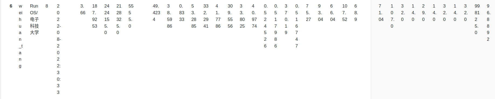

# RunOS

[](https://github.com/wei-huan)[](./LICENSE "LICENSE")[](https://github.com/wei-huan/RunOS)

[toc]


一款用 Rust 语言开发的多核 RISC-V (RV64GC) 架构的类Unix内核.

本项目是在rCore-Tutorial-v3项目的基础上,借鉴了UltraOS设计的支持多核的操作系统内核.


## 第二轮成绩
k210 赛道



## 特点

- 多核
- 虚拟内存
- 写时复制(COW)
- Fat32 文件系统(RunFS)
- 完善的日志和调试功能
- 88 个 syscall 实现


## 安装

```shell
git clone https://github.com/wei-huan/RunOS.git
```


## 运行

### qemu

```shell
cd RunOS && make clean
# 制作文件系统镜像
make fat32-oscomp PLATFORM=qemu
# 编译运行
make run PLATFORM=qemu SBI=opensbi LOG=INFO
```


### k210

```shell
cd RunOS && make clean
# 制作文件系统镜像,需要插入sdcard,sdcard默认文件名为/dev/sda,需要根据自己的情况修改
# oscomp/addoscompfile2fs.sh里的FAT32_IMG变量
make fat32-oscomp PLATFORM=k210
# 编译运行 k210的串口默认文件名为/dev/ttyUSB0,需要根据自己的情况修改kernel/Makefile里的
# K210-SERIALPORT变量
make run PLATFORM=k210 SBI=rustsbi LOG=INFO
```


## 截图


## 文档

[多核设计](./docs/多核设计.md)

[调度逻辑](./docs/调度逻辑.md)

[文件系统](./docs/文件系统.md)


## 演示

演示的git文件过大可能无法加载,查看请打开picture文件夹的源文件.


### qemu


### k210


## 致谢

吴一凡等rCore-v3开发者

洛佳(RustSbi开发者)

李程浩, 宫浩辰, 任翔宇(UltraOS开发团队)

OpenSbi开发团队


## 版本信息
0.5.0 使用 runfs 文件系统的 os
