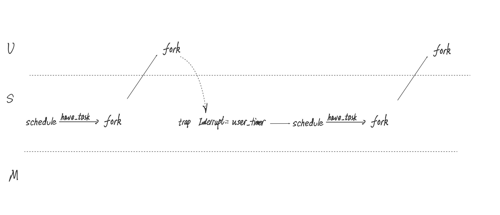

# 调度逻辑

[toc]

相比rCore-Tutorial-v3,RunOS提供了更加灵活的调度实现方式.RunOS不仅支持用户态的时钟中断发起调度,还支持在内核态的时钟中断.这使得RunOS在内核态能完成更多重要工作.大大扩展了内核的灵活性和功能.


接下来具体的分析实现者打算通过结合两大类情况,即有任务和无任务分析.


## 无任务

如果一个CPU无任务进行,那么他就会进入idle_task执行统计,然后休眠wfi等待下一次时钟中断唤醒.如图


直到有任务才会跳出这个循环.


idle_task具体做的事情如下

```Rust
//kernel/src/task/idle_task.rs

pub static mut TIME_TO_SCHEDULE: [bool; 4] = [false; 4];

pub fn idle_task() {
    // statistics
    let mut cpu = take_my_cpu();
    cpu.idle_cnt += 1;
    // let idle_cnt = cpu.idle_cnt;
    // let task_cnt = cpu.task_cnt;
    drop(cpu);
    // log::debug!("idle_cnt: {}", idle_cnt);
    // log::debug!("task_cnt: {}", task_cnt);
    // let cpu_usage: f32 = task_cnt / (idle_cnt + task_cnt);
    // println!("CPU Usage: {:<3}", cpu_usage);
    interrupt_on();
    log::trace!("NP"); // No Process
    unsafe {
        while !TIME_TO_SCHEDULE[hart_id()] {
            wfi()
        }
        TIME_TO_SCHEDULE[hart_id()] = false;
    }
}
```


统计CPU调度次数,空闲次数和使用率.

然后进入一个while循环一直wfi,等待被唤醒.唤醒条件TIME_TO_SCHEDULE在下一个时钟中断到达时设置为真.时钟中断处理函数在trap中.

管态的trap处理函数如下

```Rust
//kernel/src/trap/trap.rs

#[no_mangle]
pub fn kernel_trap_handler() {
    let scause = scause::read();
    match scause.cause() {
        Trap::Interrupt(Interrupt::SupervisorTimer) => {
            log::trace!("Supervisor Timer");
            set_next_trigger();
            unsafe {
                TIME_TO_SCHEDULE[hart_id()] = true;
            }
        }
	// ...后面忽略
}

```

当时钟中断到达时把对应核的TIME_TO_SCHEDULE设置为true.


## 有任务

在没有真正加载用户任务之前并不是没有任务在运行.和Linux类似,rCore和RunOS也有初始进程和shell,在完成初始化后,正式调度之前init_process就已经加入0号核的就绪队列了,加入0号核是固定写死了,这并不违背SMP架构,只是为了方便调试,减少不确定变量,这部分是在初始化时候执行.


```Rust
// kernel/src/scheduler/mod.rs

pub fn add_initproc() {
    add_initproc_into_fs();
    add_task_to_designate_queue(INITPROC.clone(), 0);
}
```


随后init_process加载shell程序,shell程序会加入0号核的就绪队列.因为RunOS实现的RoundRobinScheduler在add_task时候会把任务加入长度最短的就绪队列,如果长度相同就加入id最小核的就绪队列,init_proc已经在运行了,不在0号核的就绪队列,两条就绪队列长度都是0,所以shell就还是加入0号就绪队列.现在的模式如图.


对于一个普通任务,其生命都是以fork调用新建TCB开始,然后返回用户态继续执行exec真正开始创建自己的地址空间,exec之后TCB会在就绪队列中等待被调用执行.可以说从exec之后一个任务才算真正开启自己的人生.假设新加入的任务叫做fork此时RunOS调度示意图,如图.


fork任务执行流程如图




这个流程和rCore-Tutorial-v3是大体一样的,中间的内容就不赘述了.不同的地方在于时间中断中会调用的**suspend_current_and_run_next**不太一样.


```Rust
//kernel/src/trap/trap.rs

#[no_mangle]
pub fn user_trap_handler() -> ! {
    set_kernel_trap_entry();
    let scause = scause::read();
    let stval = stval::read();
    match scause.cause() {
        //...其他分支省略
        Trap::Interrupt(Interrupt::SupervisorTimer) => {
            log::trace!("User Timer");
            set_next_trigger();
            suspend_current_and_run_next();
        }
        //...其他分支省略
    }
    trap_return();
}
```


```Rust
// kernel/src/task/mod.rs

pub fn suspend_current_and_run_next() {
    // log::debug!("suspend");
    // There must be an application running.
    let task = take_current_task().unwrap();
    // ---- access current TCB exclusively
    let mut task_inner = task.acquire_inner_lock();
    let task_cx_ptr = &mut task_inner.task_cx as *mut TaskContext;
    // Change status to Ready
    task_inner.task_status = TaskStatus::Ready;
    drop(task_inner);
    // ---- release current PCB

    // push back to ready queue.
    add_task_to_designate_queue(task, hart_id());
    // jump to scheduling cycle
    // log::debug!("suspend 1");
    save_current_and_back_to_schedule(task_cx_ptr);
    // log::debug!("back to suspend");
}
```


**suspend_current_and_run_next**中把当前任务是放回运行的CPU对应的就绪队列中的,*add_task_to_designate_queue(task, hart_id())*执行这一部操作.目的是防止Bug,如果任务跑到别的CPU执行,有虚拟地址相关的页错误,目前没找到解决办法.说明RunOS的实现者还有很长的路要走(呜呜呜).

